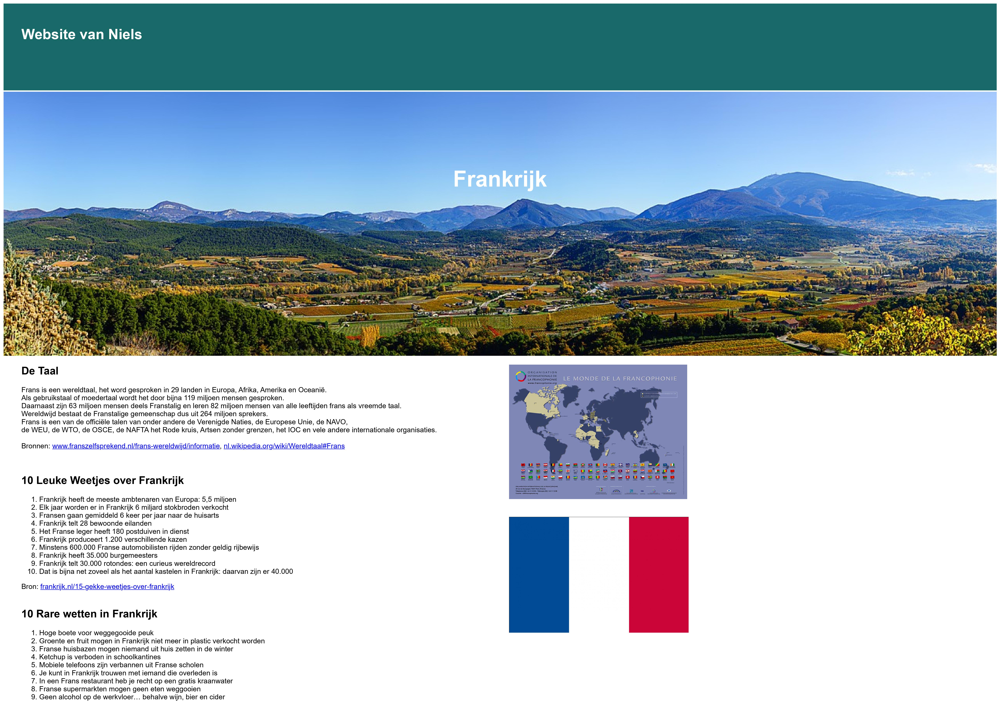
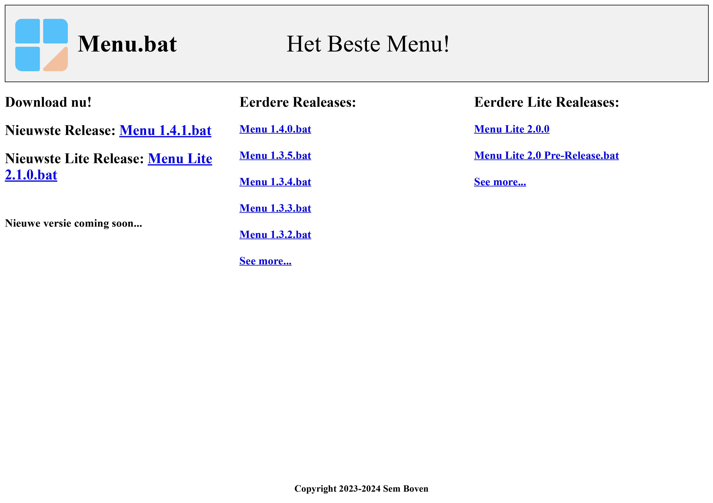

<h1>👋 Hi, I’m <a href="https://github.com/niels-joel" alt="My Profile">@niels-joel</h1></a>

  
<h3>- I'm currently learning HTML and CSS (and a little bit of Python)</h3>

<h3>- Here are some of my Websites 👇</h3>

<a href="https://niels-joel.github.io/frankrijk/" alt="Frankrijk Website">Frankrijk</a>

<a href="https://niels-joel.github.io/menu/" alt="Menu Website">Menu</a>

               
<h3>- My Statistics👇</h3>

 
  

<!---

- 👀 I’m interested in ...
- 🌱 I’m currently learning ...
- 💞️ I’m looking to collaborate on ...
- 📫 How to reach me ...
- 😄 Pronouns: ...
- ⚡ Fun fact: Moi

niels-joel/niels-joel is a ✨ special ✨ repository because its `README.md` (this file) appears on your GitHub profile.
You can click the Preview link to take a look at your changes.
--->
